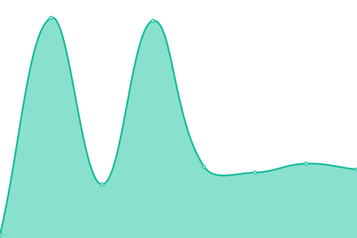
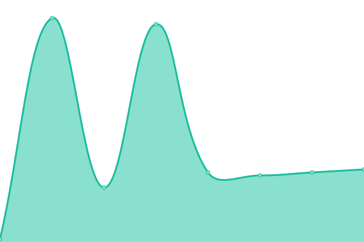
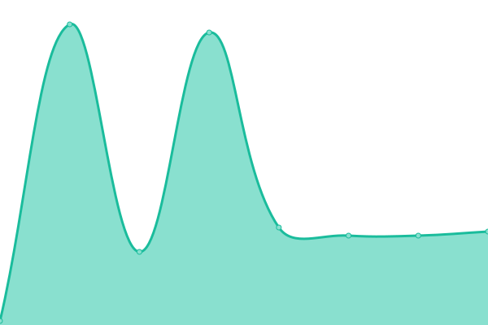

# [📈 Live Status](https://status.zptx.dev): <!--live status--> **All services report as healthy.**

This repository contains the open-source uptime monitor and status page for [ZPTX](https://zptx.dev/), powered by [Upptime](https://github.com/upptime/upptime).

With [Upptime](https://upptime.js.org), you can get your own unlimited and free uptime monitor and status page, powered entirely by a GitHub repository. We use [Issues](https://github.com/ZPTXDev/status/issues) as incident reports, [Actions](https://github.com/ZPTXDev/status/actions) as uptime monitors, and [Pages](https://status.zptx.dev) for the status page.

<!--start: status pages-->
<!-- This summary is generated by Upptime (https://github.com/upptime/upptime) -->
<!-- Do not edit this manually, your changes will be overwritten -->
<!-- prettier-ignore -->
| URL | Status | History | Response Time | Uptime |
| --- | ------ | ------- | ------------- | ------ |
|  Quaver | 🟩 Up | [quaver.yml](https://github.com/ZPTXDev/status/commits/HEAD/history/quaver.yml) | 

 127ms
     
 | 

<a href="https://status.zptx.dev/history/quaver">100.00%</a>
    

|  Quaver Dev | 🟩 Up | [quaver-dev.yml](https://github.com/ZPTXDev/status/commits/HEAD/history/quaver-dev.yml) | 

 127ms
     
 | 

<a href="https://status.zptx.dev/history/quaver-dev">100.00%</a>
    

|  Lavalink | 🟩 Up | [lavalink.yml](https://github.com/ZPTXDev/status/commits/HEAD/history/lavalink.yml) | 

 127ms
     
 | 

<a href="https://status.zptx.dev/history/lavalink">100.00%</a>
    

|  [zapteryx.com](https://zapteryx.com) | 🟩 Up | [zapteryx-com.yml](https://github.com/ZPTXDev/status/commits/HEAD/history/zapteryx-com.yml) | 

 124ms
     
 | 

<a href="https://status.zptx.dev/history/zapteryx-com">100.00%</a>
    

|  [zptx.dev](https://zptx.dev) | 🟩 Up | [zptx-dev.yml](https://github.com/ZPTXDev/status/commits/HEAD/history/zptx-dev.yml) | 

 133ms
     
 | 

<a href="https://status.zptx.dev/history/zptx-dev">100.00%</a>
    

<!--end: status pages-->

[**Visit our status website →**](https://status.zptx.dev)

## 📄 License

- Powered by: [Upptime](https://github.com/upptime/upptime)
- Code: [MIT](./LICENSE) © [Anand Chowdhary](https://anandchowdhary.com), supported by [Pabio](https://pabio.com)
- Data in the `./history` directory: [Open Database License](https://opendatacommons.org/licenses/odbl/1-0/)
